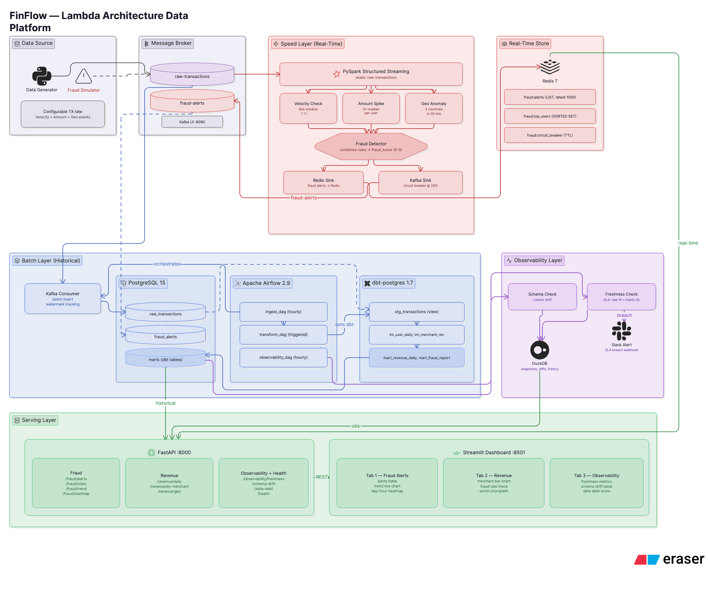

#  FinFlow — Lambda Architecture Fintech Platform


> Production-grade Lambda Architecture combining **real-time fraud detection** (Kafka + Spark Streaming) with **batch revenue analytics** (Airflow + dbt), featuring a built-in **Observability Layer** that monitors schema drift and data freshness across all pipeline layers.

---

## Architecture



```

                     DATA SOURCE                                 
            Python Generator — 1,000 tx/min                      

                           
                           

                   MESSAGE BROKER                                
         Apache Kafka — topics: raw-transactions, fraud-alerts   

                                           
       SPEED LAYER                    BATCH LAYER
                                           
                                           
       
  Spark Structured            Apache Airflow           
  Streaming                   @hourly schedule         
                                                       
  • Velocity check            ingest_dag               
  • Amount spike              → transform_dag (dbt)    
  • Geo anomaly               → observability_dag      
                                                       
  fraud_score: 0–3            Delta Lake / Postgres    
       
                                            
    Redis + Kafka                       DuckDB / Postgres
    (real-time)                         (batch warehouse)
                                            
         
                        
         
              OBSERVABILITY LAYER     
           Schema Drift Detector      
           Freshness Monitor (SLA)    
           → Slack alerts             
         
                        
         
               SERVING LAYER          
           FastAPI  +  Streamlit      
           • Fraud alert feed         
           • Revenue dashboard        
           • Pipeline health UI       
         
```

---

## Stack

| Layer | Tools | Version |
|---|---|---|
| Message Broker | Apache Kafka + Zookeeper | 7.5.0 |
| Speed Layer | PySpark Structured Streaming | 3.5.0 |
| Real-time Store | Redis | 7-alpine |
| Orchestration | Apache Airflow | 2.9.0 |
| Transformation | dbt-postgres | 1.7.0 |
| Warehouse | PostgreSQL | 15 |
| Observability Store | DuckDB | 0.9.2 |
| API | FastAPI + uvicorn | 0.109.0 |
| Dashboard | Streamlit | 1.30.0 |
| IaC | Terraform (Docker provider) | 1.7.0 |
| CI/CD | GitHub Actions | — |
| Containerization | Docker Compose | — |

---

## Quick Start

```bash
git clone https://github.com/khangdo17/finflow
cd finflow

# Setup environment
python3 -m venv .venv && source .venv/bin/activate
cp .env.example .env

# Install dependencies
make install

# Start infrastructure
make up

# Verify all services healthy
make verify
```

---

## Services

| Service | URL | Credentials |
|---|---|---|
| Airflow UI | http://localhost:8080 | admin / admin |
| Kafka UI | http://localhost:8090 | — |
| Redis Commander | http://localhost:8091 | — |
| FastAPI Docs | http://localhost:8000/docs | — |
| Streamlit Dashboard | http://localhost:8501 | — |
| Spark UI | http://localhost:4040 | — |

---

## Running the Pipeline

**1. Start the transaction generator:**
```bash
# Normal traffic
python data_generator/generator.py --mode normal --rate 1000

# Mixed (5% fraud) — recommended for demo
python data_generator/generator.py --mode mixed --rate 200

# 100% fraud — for testing speed layer
python data_generator/generator.py --mode fraud --rate 50
```

**2. Start Spark fraud detection:**
```bash
spark-submit \
  --packages org.apache.spark:spark-sql-kafka-0-10_2.12:3.5.0 \
  speed_layer/fraud_detector.py
```

**3. Trigger batch pipeline (Airflow UI):**
- Navigate to http://localhost:8080
- Enable and trigger `ingest_pipeline`
- It will auto-trigger `transform_pipeline` on success

**4. Start serving layer:**
```bash
# API
uvicorn serving.api.main:app --reload --port 8000

# Dashboard
streamlit run serving/dashboard/app.py
```

---

## Design Decisions

**Why Lambda Architecture instead of Kappa?**
Fraud detection requires sub-5-second latency — only streaming can deliver this. But revenue reporting requires high accuracy and complex multi-table joins that are expensive to run continuously. Lambda allows each concern to use the right tool: Spark Streaming for speed, dbt batch models for accuracy.

**Why Kafka instead of RabbitMQ?**
Kafka's log retention enables message replay — critical when fraud rules change and historical transactions need re-evaluation. RabbitMQ deletes messages after acknowledgment, making reprocessing impossible.

**Why DuckDB for Observability?**
Observability data (schema snapshots, freshness history) is analytical in nature — range queries over time, aggregations. DuckDB handles this with zero infrastructure overhead, no separate service to manage, and sub-second query performance on the data volumes involved.

**Why ON CONFLICT DO NOTHING for idempotency?**
Kafka consumer groups can restart from earlier offsets after a crash. Without idempotent inserts, reprocessed messages would create duplicates. `ON CONFLICT (tx_id) DO NOTHING` makes every ingest operation safe to retry.

---

## Project Structure

```
finflow/
 infrastructure/
    docker-compose.yml
    init-sql/
        01_create_tables.sql
 terraform/
    main.tf
    variables.tf
    outputs.tf
 data_generator/
    __init__.py
    profiles.py
    generator.py
    fraud_simulator.py
 speed_layer/
    __init__.py
    spark_streaming.py
    fraud_detector.py
    rules/
       __init__.py
       velocity_check.py
       amount_spike.py
       geo_anomaly.py
    sink/
        __init__.py
        redis_sink.py
        kafka_sink.py
 batch_layer/
    kafka_consumer.py
    dags/
       example_dag.py
       ingest_dag.py
       transform_dag.py
       observability_dag.py
    dbt/
        finflow/
            dbt_project.yml
            profiles.yml
            packages.yml
            models/
               staging/
                  sources.yml
                  stg_transactions.sql
               intermediate/
                  int_user_daily_summary.sql
                  int_merchant_revenue.sql
               marts/
                   schema.yml
                   mart_revenue_daily.sql
                   mart_fraud_report.sql
            tests/
                assert_no_negative_amount.sql
                assert_fraud_rate_reasonable.sql
 observability/
    __init__.py
    schema_check.py
    freshness_check.py
 serving/
    __init__.py
    api/
       __init__.py
       main.py
       routes/
           __init__.py
           fraud.py
           revenue.py
           health.py
           observability.py
    dashboard/
        app.py
 scripts/
    verify_connections.py
 tests/
    test_generator.py
    test_speed_layer.py
 .github/
    workflows/
        ci.yml
 .env.example
 .gitignore
 CLAUDE.md
 DEMO.md
 Makefile
 README.md
 requirements.txt
```

---

## Troubleshooting

| Error | Cause | Fix |
|---|---|---|
| `NoBrokersAvailable` | Kafka not ready | Wait 60s, run `make verify` again |
| `Postgres connection refused port 5433` | Container not healthy | `docker ps \| grep postgres` — wait for healthy |
| `yaml: mapping key already defined` | Duplicate keys in docker-compose | Only one `services:` and one `volumes:` block allowed |
| `Makefile missing separator` | Spaces instead of tabs | Recreate with `printf` command |
| Spark OOM | shuffle.partitions too high | Set `spark.sql.shuffle.partitions=4` for local mode |
